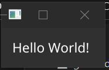
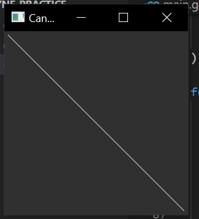

# Fyne Practice

## application and run loop

## code 

```go
package main
import (
	"fmt"

	"fyne.io/fyne/v2/app"
	"fyne.io/fyne/v2/widget"
)

func main() {
	myApp := app.New()
	myWindow := myApp.NewWindow("Hello")
	myWindow.SetContent(widget.NewLabel("Hello"))

	myWindow.Show()
	myApp.Run()
	tidyUp()
}

func tidyUp() {
	fmt.Println("Exited")
}
```

## Output


#
#

## Window Handling


## code 
```go

package main

import (
	"time"

	"fyne.io/fyne/v2"
	"fyne.io/fyne/v2/app"
	"fyne.io/fyne/v2/widget"
)

func main() {
	myApp := app.New()
	myWindow := myApp.NewWindow("Hello")
	myWindow.SetContent(widget.NewLabel("Hello World!"))

	go showAnother(myApp)
	myWindow.ShowAndRun()
}

func showAnother(a fyne.App) {
	time.Sleep(time.Second * 5)

	win := a.NewWindow("Shown later")
	win.SetContent(widget.NewLabel("5 Seconds later"))
	win.Resize(fyne.NewSize(200, 200))
	win.Show()

	time.Sleep(time.Second * 5)
	win.Close()
}

```

## Output



#
#
## Canvas and CanvasObject

## Code 

```go

package main

import (
	"image/color"
	"time"

	"fyne.io/fyne/theme"
	"fyne.io/fyne/v2"
	"fyne.io/fyne/v2/app"
	"fyne.io/fyne/v2/canvas"
)

func main() {
	myApp := app.New()
	myWindow := myApp.NewWindow("Canvas")
	myCanvas := myWindow.Canvas()

	green := color.NRGBA{R: 0, G: 180, B: 0, A: 255}
	text := canvas.NewText("Dr. Tareq Ibna Rahman", green)
	text.TextStyle.Bold = true
	myCanvas.SetContent(text)
	go changeContent(myCanvas)

	myWindow.Resize(fyne.NewSize(200, 200))
	myWindow.ShowAndRun()
}

func changeContent(c fyne.Canvas) {
	time.Sleep(time.Second * 10)

	blue := color.NRGBA{R: 0, G: 0, B: 180, A: 255}
	c.SetContent(canvas.NewRectangle(blue))

	time.Sleep(time.Second * 10)
	c.SetContent(canvas.NewLine(color.Gray{Y: 180}))

	time.Sleep(time.Second * 10)
	red := color.NRGBA{R: 0xff, G: 0x33, B: 0x33, A: 0xff}
	circle := canvas.NewCircle(color.White)
	circle.StrokeWidth = 4
	circle.StrokeColor = red
	c.SetContent(circle)

	time.Sleep(time.Second * 10)
	c.SetContent(canvas.NewImageFromResource(theme.FyneLogo()))
}
```

## Output 


### Text color Green
#


### Blue Rectangle
#



## Gray Line 
#


## White Circle
#


## Logo 


#
#
## Container and Layouts

## Code

```go
package main

import (
	"image/color"

	"fyne.io/fyne/v2"
	"fyne.io/fyne/v2/app"
	"fyne.io/fyne/v2/canvas"
	"fyne.io/fyne/v2/container"
)

func main() {
	myApp := app.New()
	myWindow := myApp.NewWindow("Container")
	green := color.NRGBA{R: 0, G: 180, B: 0, A: 255}

	text1 := canvas.NewText("Md. Tareq", green)
	text2 := canvas.NewText("Front-end Developer", green)
	text2.Move(fyne.NewPos(20, 20))
	content := container.NewWithoutLayout(text1, text2)

	myWindow.SetContent(content)
	myWindow.ShowAndRun()

}
```

## Output with code (Output on right)


